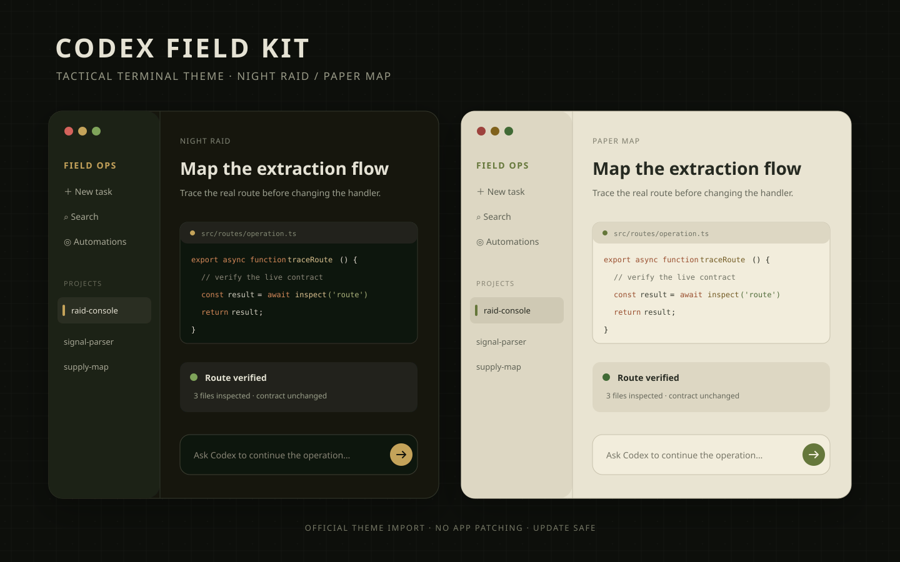

# Codex Field Kit



一套为 Codex 桌面客户端与 Codex CLI 设计的战术终端主题。视觉灵感来自撤离射击游戏常见的军用终端、旧纸地图和琥珀色仪表，不包含游戏 Logo、音乐、语音或提取素材。

项目包含：

- Codex 桌面端深色主题 **Night Raid**；
- Codex 桌面端浅色主题 **Paper Map**；
- 与桌面端配套的两份 Codex CLI `.tmTheme`；
- Windows 一键安装脚本；
- 可在 Codex 内生成配套“战术信标无人机”宠物的提示词；
- 无依赖的主题生成与校验脚本。

## 快速安装

### Codex 桌面端

1. 打开 Codex，按 `Ctrl+,` 进入设置。
2. 进入 **Appearance / 外观**。
3. 在 **Dark theme** 或 **Light theme** 卡片中点击 **Import**。
4. 复制并粘贴对应文件的完整一行内容：
   - 深色：[desktop/codex-field-kit-dark.txt](desktop/codex-field-kit-dark.txt)
   - 浅色：[desktop/codex-field-kit-light.txt](desktop/codex-field-kit-light.txt)
5. 选择 Dark、Light 或 System 作为当前外观。

桌面主题使用 Codex 官方 `codex-theme-v1:` 分享格式，不修改、不替换客户端文件。主题导入功能见 [OpenAI 官方设置文档](https://learn.chatgpt.com/docs/reference/settings)。

### Windows：桌面主题复制 + CLI 安装

在 PowerShell 中运行：

```powershell
./scripts/install.ps1 -Variant dark
```

脚本会：

- 将选中的桌面端主题字符串复制到剪贴板；
- 把两份 CLI 主题复制到 `$CODEX_HOME/themes`，未设置 `CODEX_HOME` 时使用 `%USERPROFILE%\.codex\themes`；
- 输出下一步的导入提示。

只安装 CLI 主题：

```powershell
./scripts/install.ps1 -SkipClipboard
```

只复制浅色桌面主题：

```powershell
./scripts/install.ps1 -Variant light -SkipCli
```

### Codex CLI

安装后启动 `codex`，输入 `/theme`，选择：

- `Codex Field Kit Dark`
- `Codex Field Kit Light`

也可以手动把 [themes](themes) 目录中的 `.tmTheme` 文件放入 `$CODEX_HOME/themes`。这是 OpenAI 官方支持的 CLI 自定义主题方式，详见 [CLI customization](https://learn.chatgpt.com/docs/cli-customization)。

## 配色

| 角色 | Night Raid | Paper Map | 用途 |
| --- | --- | --- | --- |
| Surface | `#151711` | `#E9E4D2` | 主背景 |
| Ink | `#E5E2D4` | `#262920` | 主文字 |
| Accent | `#C4A35A` | `#65773A` | 焦点、按钮、链接 |
| Diff added | `#7FA45A` | `#416B35` | 新增内容 |
| Diff removed | `#D4645C` | `#9D423C` | 删除和错误 |
| Skill | `#B29ACB` | `#6F5687` | 技能与特殊状态 |

详细设计令牌见 [docs/design.md](docs/design.md)。桌面主题内置了跨平台字体回退栈；CLI 主题负责代码、Markdown 与 diff 的语法色。

## 配套宠物

Codex 桌面端支持本地自定义宠物。打开 **Settings > Pets > Create pet**，把 [pet/PET_PROMPT.md](pet/PET_PROMPT.md) 中的提示词发送给自动打开的宠物创建任务即可。宠物由 Codex 官方 `hatch-pet` 工作流在本机生成，不需要替换客户端资源。

## 开发与校验

```bash
npm test
```

`npm test` 会重新生成桌面主题分享字符串，并检查：

- `codex-theme-v1:` 前缀和 JSON 结构；
- 深浅主题的 variant、颜色、对比度和语义色；
- 生成文件与源配置一致；
- 两份 `.tmTheme` 都是可解析的 XML plist；
- 安装脚本引用的所有文件都存在。

主题源配置在 [desktop/themes.json](desktop/themes.json)。修改后运行 `npm run build`。

## 与参考项目的关系

本项目受 [ZHIGENGNIAO258/dsh-theme-tarkov](https://github.com/ZHIGENGNIAO258/dsh-theme-tarkov) 的产品思路启发。参考项目是 DeepSeek Harness Web 插件，依赖 DSH 的 Host 路由和浏览器注入点，不能直接用于 Codex。

本仓库没有复制参考项目的客户端注入代码、音频或游戏素材；它使用 Codex 官方主题分享、CLI `.tmTheme` 和官方自定义宠物入口重新实现相近的视觉体验。

## 兼容性

- 桌面主题格式已按 Codex Windows `26.915.4065.0` 的导入契约生成；Codex 在 `26.312` 版本加入了自定义主题功能。
- CLI 主题按 Codex CLI `0.150.1` 的 `.tmTheme` 入口验证。
- 如果后续 Codex 升级主题分享版本，运行 `npm test` 仍可检查本仓库内部一致性，但需要按新版客户端重新导出一次分享字符串。

## 声明

这是非官方社区主题，与 OpenAI 或 Battlestate Games 无隶属关系。“Codex”“Escape from Tarkov”等名称与商标归各自权利人所有。

## License

MIT
